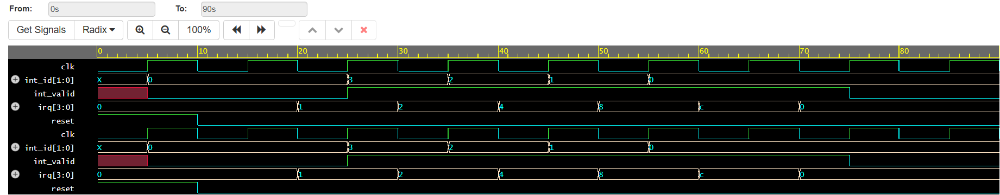

# Interrupt Controller with Priority Arbitration

This Verilog project implements a 4-level interrupt controller where `irq[0]` has the highest priority and `irq[3]` the lowest.

## 💡 Features
- Priority-based interrupt selection
- Outputs the ID of the highest active interrupt
- Simulated using Icarus Verilog and GTKWave

## 🧪 Test Cases
- IRQs from 0 to 3 are triggered one by one
- When multiple IRQs are active, the highest priority is selected
- Output observed through waveform

## ⚙️ Tools Used
- Icarus Verilog (simulation)
- GTKWave (waveform viewer)
- EDA Playground (online test)
## 🖼️ Output Waveform

## 👨‍💻 Author
Harsha Dharmavaram

